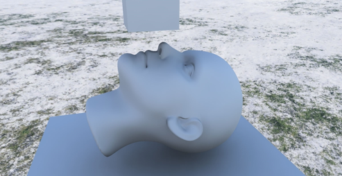

# Raytraced_Radiance_Transfer
A simple project for learning DX12 and DirectX Raytracing API. 
Trace 4 rays each pixel each frame(4spp) to capture low frequencies of environment lighting, 
and use spatial temporal filtering to denoise shading result. 
Dynamically update the light probe in the scene. 

## Instruction
* Use WASD to move camera, and use mouse to look around.
* Use IJKL to move the object in the scene.

## Requirements
- RTX Graphics Card
- Visual Studio 2019 or higher version

## Motivation
To learn DX12 and DirectX Raytracing API, I decide to use the API to write something,
then I found implementing real-time raytracing denoising algorithms is an interesting option.
As a beginner, it's a great pain to write native non-encapsulation DirectX12 code. 
At the end, although I made it, the code was already in a mess. 
By the way, the code structure is built upon Frank D. Luna's book
[Introduction to 3D Game Programming with Direct3D 12.0](http://d3dcoder.net/d3d12.htm) and
Microsoft's [Direct3D 12 raytracing samples](https://learn.microsoft.com/en-us/samples/microsoft/directx-graphics-samples/d3d12-raytracing-samples-win32/).

## Result
You can see the soft shadow and the diffuse reflection of environment lighting.

